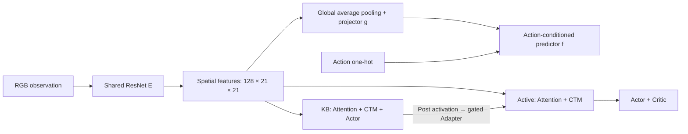

# TAPD & CTM跨任务联合训练

本项目基于 [continuous-thought-machines
](https://github.com/SakanaAI/continuous-thought-machines/blob/main/README.md)，将 TAPD 的任务无关探索与 Progress & Compress 思想整合进带视觉 Attention 的 CTM，在 **2D Maze（mazes-medium）与 MiniGrid FourRooms** 之间顺序训练。核心目标是：先通过预测驱动的探索学习共享视觉与可迁移策略，再通过任务奖励学习和策略压缩积累知识。

## 1. 任务与共享架构

两个任务统一为单帧 RGB 观察 $o_t\in\mathbb{R}^{3\times84\times84}$ 和五维离散动作分布；模型不接收任务 ID。Maze 使用上、下、左、右、等待；FourRooms 使用左转、右转、前进及两个独立等待槽。Maze 保留原始地图视觉，FourRooms 使用带遮挡的局部可见区域像素图。

共享视觉编码器 $E$ 为随机初始化、截断至第二个残差阶段的 ResNet-34，输出 $128\times21\times21$ 特征图。其后分为世界模型与双列策略两条路径：

**知识库 KB** 包含独立的 Attention、CTM 和 Actor，不含 Critic。**活动列 Active** 包含同构控制器、Actor 和 Critic；每个探索或任务学习阶段都重新随机初始化 Active 与 Adapter，KB 权重持续保留。最终部署策略仅使用 **E + KB**。

### CTM与空间Attention

CTM 每个环境步推进两个内部 tick，维护长度为20 ticks的神经元历史。每个 tick 根据历史 post activation 的同步表示生成 Query，对 ResNet 的 $21\times21=441$ 个空间 token 执行四头 cross-attention：

$$c_k=\text{Concat}_{h=1}^{4}\left[\text{softmax}\left(\frac{\widetilde Q_{k,h}\widetilde K_h^{\top}}{\sqrt{32}}\right)V_h\right]W_O.$$

$\widetilde Q,\widetilde K$ 为施加二维轴向 RoPE 后的投影，V不旋转。Query内容由CTM状态决定，位置编码固定在特征图中心。Attention输出与上一tick激活共同进入synapse，再由各神经元独立的时间模型（NLM）生成新激活；另一组同步表示供Actor/Critic读出。KB与Active共享视觉特征，但各自拥有Attention参数与循环状态。世界模型使用的全局平均池化不会作用于CTM输入。

### KB到Active的横向连接

每个内部tick $k$ 先更新KB，再将其**当前tick的新激活**传给Active：

$$
\ell_k=\tanh(\alpha)W_{\mathrm{lat}}\text{LN}\left(\text{sg}(h_k^{\mathrm{KB}})\right),
\qquad
u_k^{A}=\text{Synapse}_{A}\left([c_k^{A};\ h_{k-1}^{A}+\ell_k]\right).
$$

$\text{sg}$ 表示停止梯度；横向信息与Active上一tick激活**相加**后，再与Attention输出拼接。Adapter使用零初始化的标量门控，首次压缩前关闭侧连。学习Active时冻结KB，梯度仅更新Active和Adapter；当前tick的横向输入通过新状态影响后续tick的视觉查询。

## 2. 整体训练流程

训练按Maze→FourRooms顺序访问任务，分为两个时期：

- **Task-Agnostic：** 默认执行4个 visit，每个 visit 按顺序访问两个任务；每次任务访问执行两轮 $W\rightarrow X\rightarrow C\rightarrow F$，visit 数可通过 `agnostic.visits` 配置；不使用外在奖励优化策略。
- **Progress & Compress：** 永久冻结视觉编码器，每次任务访问执行 $P\rightarrow C\rightarrow F$，共3次完整任务遍历。

| 阶段 | 训练方法与目标 | 更新对象 |
|---|---|---|
| W：World Model | 固定快照采集，然后最小化预测MSE与SIGReg | E、projector、predictor |
| X：Exploration | 好奇心奖励下的循环PPO-clip | Active、Adapter、Critic |
| C：Compress | 冻结教师到KB的动作分布蒸馏，加Online EWC | KB的Attention、CTM、Actor |
| F：Fisher | KB自身轨迹上的无奖励策略Fisher估计 | 仅更新重要性统计和参数中心，不更新权重 |
| P：Progress | 外在任务奖励下的循环PPO-clip | Active、Adapter、Critic |

E只在W拟合时更新，其他阶段冻结参数与BN统计；TA结束后E永久冻结。W拟合前将当前任务的fresh和high-error像素回放解压到内存，采样分布与训练目标不变。

## 3. W：预测驱动的视觉学习

W首先使用冻结的旧E与KB快照采集当前任务的图像转移。拟合时，将新数据与该任务最近一次X的高预测误差数据按1:1混合；首次无旧池时全部使用新数据。池保存原始图像，并由当前编码器重新计算表示，不跨任务混池。

对当前帧与下一帧定义：

$$
z_t=g\left(\text{GAP}(E(o_t))\right),\qquad
\widehat z_{t+1}=f\left([z_t;\text{onehot}(a_t)]\right).
$$

GAP为空间全局平均池化，$z_t\in\mathbb{R}^{128}$。projector为128→512→128，predictor为133→512→128的MLP，隐藏层使用ReLU，输出层为线性层。损失为：

$$
\mathcal L_W=
\frac{1}{Bd}\sum_{b=1}^{B}\left\|\widehat z_{t+1}^{(b)}-z_{t+1}^{(b)}\right\|_2^2
+\frac{\lambda_{\mathrm{sig}}}{2}\left[\mathcal R(Z_t)+\mathcal R(Z_{t+1})\right],
\qquad d=128,\quad\lambda_{\mathrm{sig}}=0.02.
$$

当前帧与下一帧分支都参与反传，不使用stop-gradient目标编码器。SIGReg通过随机方向上的经验特征函数，约束投影分布接近标准高斯，以抑制表示坍塌：

$$
\mathcal R(Z)=B\,\mathbb E_{\|v\|_2=1}\int_{-3}^{3}
\left|\frac1B\sum_{b=1}^{B}e^{\mathrm{i}\omega v^\top z^{(b)}}-e^{-\omega^2/2}\right|^2
 e^{-\omega^2/2}\,d\omega.
$$

实现以有限随机方向和数值积分近似该目标。

## 4. X与P：循环PPO学习

X冻结世界模型，以预测误差定义内在奖励：

$$
r_t^{\mathrm{int}}=\log\left(1+\left\|\widehat z_{t+1}-z_{t+1}\right\|_2\right).
$$

X仅使用此奖励，不混合外在奖励。每个任务保留本轮误差最高的转移，整体替换该任务旧池，供下一轮W使用。

P使用外在任务奖励：在episode第 $t$ 步成功时奖励为 $1-0.9t/300$，其余步骤为0；每个episode最多300步。它鼓励更快成功，但没有逐步负奖励。

两个阶段使用相同的循环PPO-clip目标。令 $\rho_t=\pi_\theta(a_t\mid H_t)/\pi_{\mathrm{old}}(a_t\mid H_t)$，$H_t$ 表示循环策略所依赖的观察历史，则最小化：

$$
\mathcal L_{\mathrm{PPO}}=
-\mathbb E_t\left[\min\left(\rho_t\widehat A_t,
\text{clip}(\rho_t,1-\epsilon,1+\epsilon)\widehat A_t\right)\right]
+\frac{c_v}{2}\mathbb E_t\left[(V_\theta(H_t)-\widehat R_t)^2\right]
-c_H\mathbb E_t\left[\mathcal H(\pi_\theta(\cdot\mid H_t))\right].
$$

默认 $\epsilon=0.1,c_v=0.25,c_H=0.01$。优势由GAE估计，并在policy loss中标准化；时间序列内部反传，rollout边界截断梯度。成功终止不bootstrap，超时从真实末帧bootstrap，但GAE不跨episode传播。冻结视觉并不阻断Active内部Attention的参数学习。

## 5. C与F：压缩和知识保持

C冻结学习后的完整双列教师，包括旧KB、Active及Adapter，并采集教师策略轨迹。学生KB使用自己的循环状态，以动作分布KL蒸馏教师，同时用Online EWC约束重要参数：

$$
\mathcal L_C=
\mathbb E_t\left[D_{\mathrm{KL}}\left(\pi_T(\cdot\mid H_t)\,\|\,\pi_{\mathrm{KB}}(\cdot\mid H_t)\right)\right]
+\frac{\lambda_{\mathrm{EWC}}}{2}\sum_i\Omega_i(\theta_i-\theta_i^*)^2,
\qquad \lambda_{\mathrm{EWC}}=250.
$$

首次压缩不施加EWC。蒸馏使用10个历史观察（20 ticks）进行无梯度burn-in，再在学习窗口反传；这是一种有限历史近似，不复制教师的循环状态，也不蒸馏Critic或hidden state。

每次C完成后执行F：由当前KB采样动作，估计逐样本策略log-prob梯度平方的均值：

$$
\widehat F_i=\frac1N\sum_{n=1}^{N}
\left[\frac{\partial}{\partial\theta_i}\log\pi_{\mathrm{KB}}(a_n\mid H_n)\right]^2,
\qquad
\Omega_i\leftarrow\gamma_F\Omega_i+\widehat F_i,\qquad
\theta_i^*\leftarrow\theta_i.
$$

首次令 $\Omega=\widehat F$；TA与P&C分别采用 $\gamma_F=0.1$ 和 $0.3$。该估计不使用奖励或Critic，不修改KB权重；EWC仅保护KB，不约束视觉、Adapter或Active。下一轮重新初始化Active，通过侧连读取持续保留的KB。

## 6. 实验对照与评估

单任务CTM、顺序PPO以及不含探索蒸馏的P&C对照，共享同seed主方法TA结束后的冻结视觉权重，但独立初始化控制器；因此它们属于**共享视觉预训练条件下的对照**。报告区分共享TA成本与各组新增训练成本。

一次visit包含依次完成两个任务的全部训练轮次。TA仅在visit结束评估当前KB；P&C在visit结束评估最终KB及两个任务各自P结束时的Active，每个策略都测试两个任务。Active保留当时的Adapter和旧KB，视觉编码器在P&C期间冻结。评估采用固定面板、argmax策略、并行环境和批量推理，记录成功率、回报、episode长度及KB跨visit遗忘；训练结束另对最终策略执行独立test。主方法最终使用E+KB，单列对照使用E及自身策略。完整smoke验证训练与恢复流程，不构成跨任务性能结论。运行与复现实验说明见[实现文档](tasks/continual_nav/README.md)。
